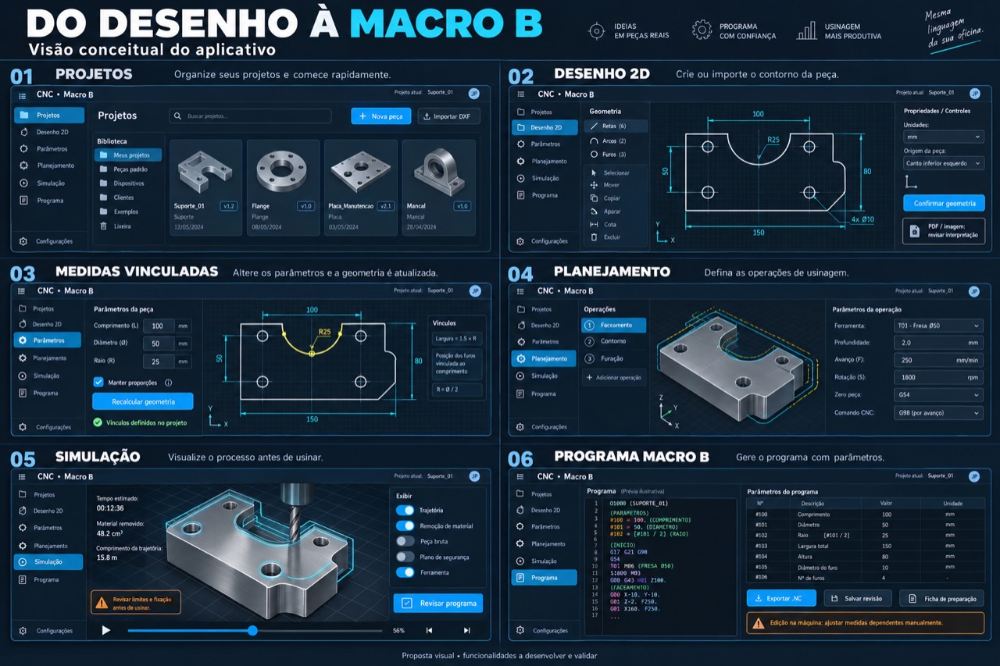

# Plano de desenvolvimento — App CNC Macro B

Versão: 0.1 · Data: 08/09/2026 · Responsável pelo produto: Leonardo

## Referência visual recebida — 12/09/2026

Imagem escolhida por Leonardo: **Do desenho à Macro B — Visão conceitual do aplicativo**.
Arquivo preservado em `docs/referencias/conceito-montador-macro-b.jpg`.



### Estrutura do aplicativo

As seis cenas representam etapas de um mesmo aplicativo; não são seis painéis
que precisam aparecer simultaneamente. O Montador será a base dessa evolução.
Barra lateral persistente à esquerda: Projetos, Desenho 2D, Parâmetros,
Planejamento, Simulação e Programa; Configurações no rodapé. Barra superior
compacta identifica o aplicativo e o projeto ativo. Conteúdo central amplo,
com ferramentas à esquerda e propriedades à direita conforme a etapa.

| Etapa | Organização e elementos visíveis na referência | Comportamento a construir |
| --- | --- | --- |
| Projetos | Biblioteca lateral, busca, cartões com miniatura da peça, nome e revisão; Nova peça e Importar DXF no topo. | Criar, localizar e reabrir projetos; vincular cada revisão ao projeto. Pastas, clientes, dispositivos e lixeira são recursos futuros, não existentes por aparecerem na imagem. |
| Desenho 2D | Tela quadriculada escura, contorno branco, cotas e eixos ciano; ferramentas de retas, arcos, furos, seleção, mover, copiar, aparar, cota e excluir. Propriedades com unidades, origem e Confirmar geometria. | Desenhar ou importar contornos; conferir unidades e origem antes de usar a geometria. PDF/imagem exige revisão da interpretação. |
| Medidas vinculadas | Parâmetros numéricos à esquerda, desenho central, vínculos à direita; dimensão selecionada em amarelo, botão Recalcular geometria. | Atualizar geometria segundo vínculos explícitos. Manter proporções não significa impor escala uniforme a todo projeto. |
| Planejamento | Lista ordenada de operações à esquerda, peça e trajetórias ao centro, ferramenta e parâmetros de corte à direita. | Reutilizar a sequência, ferramentas e fichas JSON do Montador. Adicionar operações e conferir seus parâmetros. |
| Simulação | Peça em perspectiva com trajetória ciano; informações à esquerda, controles de exibição à direita; reprodução e progresso embaixo. | Evoluir primeiro o preview de trajetória. Remoção de material, estimativas de tempo e verificações de fixação exigem implementação e validação próprias. |
| Programa Macro B | Código à esquerda, tabela de parâmetros à direita; Exportar .NC, Salvar revisão e Ficha de preparação abaixo. | Relacionar parâmetros com sua origem no projeto, revisar e exportar o programa. Alterações feitas na máquina não atualizam automaticamente o projeto. |

### Direção visual

- Fundo azul-marinho quase preto; painéis em tons próximos, separados por bordas finas azuladas.
- Azul/ciano nos botões primários, etapa selecionada, cotas e trajetórias.
- Texto principal branco e texto secundário cinza claro; amarelo para seleção
  geométrica, verde para confirmação e âmbar para avisos.
- Controles compactos, cantos discretamente arredondados e ícones simples.
- Tipografia sem serifa na interface; fonte monoespaçada para código e números
  quando favorecer alinhamento. A imagem não determina uma família tipográfica exata.
- A área de desenho/peça deve ter destaque. Nos quadros com propriedades,
  ela ocupa mais espaço que cada painel lateral; proporções finais dependem
  da resolução. Não copiar textos minúsculos da montagem conceitual.
- O título grande e os números 01–06 pertencem à apresentação do conceito;
  não são uma exigência de cabeçalho dentro do aplicativo.

### Critérios para conferir o layout

Uma etapa ativa por vez, com navegação consistente; projeto ativo identificável;
área principal legível; propriedades próximas do objeto selecionado; ações
de confirmar, revisar e exportar facilmente localizáveis. A imagem será a
referência de comparação visual, com ajustes de legibilidade para uso real.
Adaptação para telas menores ainda precisa de especificação; a referência
mostra composição de desktop e não define um layout móvel completo.

### Limites técnicos e ordem de implementação

As medidas, códigos, ferramentas, origens, revisões, datas e tempos da imagem
são ilustrativos. Não copiar como defaults ou regras de usinagem. Em especial,
não usar a opção de origem mostrada para mudar o zero atual silenciosamente,
nem tratar rótulos de comandos ilustrativos como especificação Fanuc.

Preservar engine.js compartilhado, fontes JSON por família e programas anotados.
O Estúdio fica arquivado conceitualmente, sem exclusão e sem testes rotineiros.
Implementar e testar somente o Montador via HTTP; manter testes relevantes do motor.
As instruções históricas de testar ambas as interfaces ficam substituídas.

Sequência: estabilizar os avisos pendentes; criar a estrutura visual e navegação
do Montador; integrar o fluxo já funcional de Planejamento e Programa; acrescentar
Projetos/revisões; desenvolver geometria e vínculos; depois importações e simulação
avançada. Recursos ainda ausentes devem ser identificados como planejados.
Não apresentar controles inoperantes como funções prontas.

O plano antigo abaixo permanece como visão e histórico. Esta seção prevalece
quanto à interface ativa, aparência e testes. A política de avisos informativos
sem bloqueio continua em vigor, apesar de propostas antigas de bloqueio.


## 1. Comece por aqui

Você define como o app deve funcionar na oficina. A IA organiza a documentação, implementa e testa. Você não precisa aprender programação para aprovar uma tela ou conferir se uma operação corresponde ao que pediu.

O primeiro passo é disponibilizar o repositório atual por link com acesso autorizado ou arquivo ZIP. Antes de escolher tecnologias ou reescrever qualquer coisa, a IA deve ler os arquivos Markdown, o diário e o código existente.

Este plano registra a visão aprovada na conversa. O repositório ainda não foi analisado nesta entrega. Portanto, arquitetura, esforço e estado de implementação permanecem pendentes de auditoria. As imagens são referência visual: cotas, códigos e campos ilustrativos não são especificações técnicas.

### Seus primeiros cinco passos

1. Envie o repositório atual ou um ZIP, sem senhas, tokens ou credenciais.
2. Peça a execução da etapa 0 deste plano.
3. Confira o resumo: o que existe, o que funciona e o que falta.
4. Informe o primeiro comando CNC e uma peça simples para servir de referência.
5. Acompanhe uma entrega pequena por vez, usando o ciclo da seção 5.

## 2. Visão do produto

Transformar uma geometria 2D confirmada em operações de usinagem e um programa Macro B parametrizado, com revisão, visualização e rastreabilidade.

| Área | Funcionalidades previstas |
| --- | --- |
| Projetos | Criar, abrir, duplicar, pesquisar, salvar e recuperar revisões; biblioteca de peças e modelos. |
| Desenho 2D | Retas, arcos, círculos e furos; cotas, origem, unidades, seleção e edição; importação DXF. |
| Interpretação assistida | Importar PDF ou imagem, propor geometria e exigir conferência de escala, cotas e entidades ambíguas. |
| Parâmetros | Nomear dimensões, definir vínculos, recalcular dependências e indicar conflitos. |
| Planejamento | Faceamento, contorno e furação; ferramentas, profundidades, passes, avanços, rotações, origem e perfil do comando. |
| Simulação | Primeiro trajetória; depois remoção de material. Escopo de verificações de ferramenta, fixação e máquina explicitamente identificado. |
| Programa | Gerar Macro B, revisar parâmetros e código, exportar .NC, salvar revisão e emitir ficha de preparação. |

### Regra central de medidas

No app, alterações atualizam as dimensões conforme os vínculos definidos. Isso não significa escalar toda a peça automaticamente: comprimento, posição dos furos e diâmetro podem ter relações distintas.

Exemplo de referência: trecho total de 100 mm, arco semicircular central de diâmetro 50 mm e raio 25 mm. As partes retas restantes medem 25 mm de cada lado. Se o diâmetro passar para 60 mm mantendo o total em 100 mm, passam a medir 20 mm cada. Se a intenção for escalar a peça inteira, isso deve ser uma operação explícita.

Na máquina, a edição manual exige que o operador confira e ajuste as outras medidas afetadas. O programa não deve prometer reproduzir automaticamente todos os vínculos do software. O que permanece como expressão no código e o que é calculado na exportação deve estar documentado.

## 3. Documentação profissional no repositório

Markdown é texto organizado em títulos, listas e tabelas. Cada arquivo terá uma finalidade. Antes de criá-los, a IA deve localizar equivalentes existentes e aproveitá-los, evitando duas fontes contraditórias.

| Arquivo proposto | Finalidade | Quando atualizar |
| --- | --- | --- |
| README.md | Apresentação, instalação, execução e mapa da documentação. | Quando mudar o uso ou a estrutura. |
| AGENTS.md | Regras de trabalho para a IA no repositório. | Quando mudar o processo. |
| docs/VISAO.md | Objetivo, público, fluxo e limites do produto. | Quando mudar o escopo aprovado. |
| docs/REQUISITOS.md | Funcionalidades identificadas e critérios de aceitação. | Quando um requisito for detalhado ou alterado. |
| docs/ARQUITETURA.md | Módulos, responsabilidades, dados e dependências. | Quando uma decisão estrutural for implementada. |
| docs/ROADMAP.md | Etapas e marcos, com dependências. | Quando prioridades mudarem. |
| docs/BACKLOG.md | Tarefas pequenas, ordenadas e verificáveis. | A cada ciclo de trabalho. |
| docs/STATUS.md | Estado atual, impedimentos e próxima tarefa. | Ao encerrar cada ciclo. |
| docs/DIARIO.md | Registro cronológico do que foi feito e verificado. | Ao encerrar cada ciclo. |
| docs/DECISOES.md | Decisões, motivos, alternativas e consequências. | Ao tomar decisão relevante. |
| docs/VALIDACAO-CNC.md | Casos de referência, perfil do comando e evidências. | A cada validação técnica. |
| CHANGELOG.md | Mudanças entregues por versão. | Ao preparar uma versão. |

O Git registra versões dos arquivos. Um commit é um ponto de recuperação identificado. Uma branch permite trabalhar em uma mudança separada. Um pull request apresenta a diferença para revisão. A IA conduz essas operações; você recebe uma explicação curta do impacto.

## 4. Etapas de construção

### Etapa 0 — Auditoria do projeto existente

**IA:** ler regras e diário; mapear código, dependências, testes, execução e pendências; reproduzir o estado atual quando possível; identificar material reutilizável e conflitos entre documentos.

**Você:** fornecer acesso e explicar quais telas ou fluxos já usa.

**Entrega:** inventário, diagnóstico, documentação conciliada e primeira tarefa recomendada. Nenhuma reescrita ampla sem justificativa concreta.

**Conclusão:** cada área está marcada como existente e verificada, existente e não verificada, incompleta ou ausente.

### Etapa 1 — Especificação e peça de referência

**IA:** converter a visão em requisitos numerados; definir dados do projeto e exemplos esperados.

**Você:** indicar comando e máquina-alvo, fornecer uma peça simples e, se possível, um programa conhecido e validado para comparação.

**Entrega:** primeiro escopo fechado: uma peça simples, uma operação, um perfil de comando e um caminho completo de geração.

**Conclusão:** origem, unidades, geometria, ferramenta, estratégia e resultado esperado estão definidos. Informações desconhecidas permanecem registradas como pendências.

### Etapa 2 — Projetos e interface funcional

**IA:** implementar navegação, criação, abertura, salvamento, revisões e tratamento de erros; seguir a identidade visual aprovada.

**Você:** realizar um roteiro curto de uso e avaliar legibilidade e sequência das ações.

**Conclusão:** salvar e reabrir preserva os dados; entradas inválidas são explicadas; operações destrutivas têm recuperação ou confirmação apropriada.

### Etapa 3 — Geometria e vínculos

**IA:** implementar entidades geométricas e parâmetros, fechamento de contorno, unidades, tolerâncias e atualização de dependências.

**Você:** conferir desenhos e resultados numéricos dos exemplos.

**Conclusão:** exemplo 100/50/25 reproduzido; alteração para diâmetro 60 retorna trechos de 20; diâmetro incompatível é rejeitado; vínculos circulares ou conflitantes são apontados. A interface e o cálculo usam a mesma geometria.

### Etapa 4 — Primeira geração Macro B

**IA:** implementar uma operação completa para o perfil selecionado, com parâmetros rastreáveis, trajetórias, aproximação, retração e exportação.

**Você:** conferir a lógica de usinagem e os parâmetros com o caso de referência.

**Conclusão:** cada parâmetro exportado tem origem identificada; saída determinística; geometria inválida ou configuração obrigatória ausente bloqueia geração; código comparado com referências técnicas do comando e casos conhecidos.

Este é o primeiro marco funcional: criar uma peça simples, parametrizar, salvar, reabrir, gerar e revisar um programa. Ele antecede importações complexas e simulação volumétrica.

### Etapa 5 — Visualização de trajetória e validação integrada

**IA:** mostrar percurso, sentido, movimentos rápidos e de corte, níveis Z e reprodução; conferir o programa efetivamente exportado, evitando validar apenas uma trajetória interna diferente.

**Você:** revisar a sequência visual e divergências em relação ao processo esperado.

**Conclusão:** trajetórias e código correspondem nos casos suportados; recursos não interpretados são identificados. Animação visual não equivale a validação completa da máquina.

### Etapa 6 — DXF e expansão das operações

**IA:** importar entidades suportadas com relatório de incompatibilidades; acrescentar faceamento, contorno, furação e múltiplas ferramentas de maneira incremental.

**Você:** fornecer exemplos reais, incluindo arquivos com falhas conhecidas.

**Conclusão:** escala e origem são conferidas; entidades não suportadas não são descartadas silenciosamente; cada operação tem casos de teste próprios e integrados.

### Etapa 7 — Simulação de remoção de material

**IA:** representar bruto, ferramenta e material removido; documentar limites e, quando implementadas, verificações envolvendo fixação e máquina.

**Você:** comparar o resultado com a peça e o processo pretendidos.

**Conclusão:** volumes e movimentos conferidos com casos conhecidos; nenhuma alegação de detecção de colisão além do escopo realmente implementado.

### Etapa 8 — PDF, imagens e biblioteca avançada

**IA:** construir interpretação assistida, confirmação de cotas, indicação de ambiguidades, modelos reutilizáveis e ficha de preparação completa.

**Você:** confirmar a interpretação antes da programação.

**Conclusão:** nenhuma dimensão inferida é tratada como confirmada; desenho sem escala ou informação suficiente solicita correção. Um desenho 2D sozinho não define ferramenta, material, fixação ou estratégia.

### Etapa 9 — Preparação para uso controlado

**IA:** consolidar documentação, recuperação de projetos, compatibilidade de versões, empacotamento, regressões e lista de limitações conhecidas.

**Você e responsável técnico:** conduzir a validação operacional segundo os procedimentos da máquina e da empresa, antes da utilização produtiva.

**Conclusão:** versão identificada, evidências registradas e escopo suportado explícito. Novos comandos CNC exigem validação própria.

## 5. Como será cada sessão

1. **Retomar:** a IA lê as regras, o STATUS e os documentos relevantes à tarefa.
2. **Delimitar:** descreve em poucas linhas a entrega e como será verificada.
3. **Executar:** implementa uma mudança coerente, preservando trabalho existente.
4. **Verificar:** executa testes necessários e demonstra o comportamento.
5. **Registrar:** atualiza status, diário e decisões afetadas; registra a mudança no Git conforme o fluxo do projeto.
6. **Apresentar:** informa o que mudou, como conferir, limitações e próximo passo.

Você aprova decisões de produto e responde dúvidas de usinagem. A IA resolve detalhes rotineiros de implementação, sem pedir confirmação a cada arquivo.

### Modelo de tarefa para docs/BACKLOG.md

```markdown
## CNC-001 — Recalcular arco central
Estado: a fazer
Objetivo: manter o contorno coerente ao editar o diâmetro.
Dependências: geometria de reta e arco disponível.
Entrada: comprimento 100 mm; diâmetro 50 mm.
Alteração: diâmetro para 60 mm, comprimento fixo.
Aceitação: raio 30 mm; trechos retos de 20 mm; contorno válido.
Erro esperado: diâmetro maior que o comprimento é recusado.
Evidência: teste numérico e conferência visual.
```

### Modelo para docs/STATUS.md

```markdown
# Estado atual
Atualizado em: AAAA-MM-DD
Etapa atual:
Última entrega verificada:
Versão ou commit:
O que funciona:
O que ainda não foi verificado:
Impedimentos:
Próxima tarefa e critério de conclusão:
Documentos necessários para retomar:
```

### Modelo de entrada no diário

```markdown
## AAAA-MM-DD — Identificador da tarefa
Objetivo:
Alterações:
Verificações e resultados:
Limitações ou falhas:
Decisões relacionadas:
Próximo passo:
Commit, quando existente:
```

### Conteúdo inicial proposto para AGENTS.md

Adaptar ao repositório após a auditoria; não substituir regras existentes sem conciliação.

```markdown
# Regras de trabalho
- Ler o STATUS e a documentação relevante antes de implementar.
- Preservar trabalho existente e evitar reescritas sem evidência.
- Manter cálculos geométricos separados da interface.
- Manter geração de código separada dos perfis de comando.
- Documentar unidades, tolerâncias e convenções de coordenadas.
- Não inventar suporte a comandos, ciclos ou variáveis CNC.
- Consultar documentação técnica aplicável ao implementar um perfil.
- Bloquear geração quando faltar informação obrigatória.
- Não tratar código gerado ou simulação como validação de máquina.
- Testar resultados geométricos e comportamentos críticos.
- Nunca registrar credenciais no repositório ou no diário.
- Atualizar STATUS e DIARIO ao concluir uma tarefa.
- Explicar resultados ao Leonardo com linguagem curta e direta.
```

## 6. Arquitetura proposta, sujeita à auditoria

Separar as responsabilidades: interface; armazenamento de projetos; geometria e vínculos; operações e trajetórias; gerador Macro B e perfis de comando; interpretação/simulação; importação e exportação.

Uma representação comum da peça e das operações deve alimentar a tela e a geração. A simulação deve incluir conferência da saída exportada. Projetos precisam guardar versão do formato, unidades, origem, geometria, vínculos, operações e perfil utilizado.

A escolha de linguagem, bibliotecas, aplicativo web ou desktop depende do que já existe, do dispositivo pretendido e dos requisitos de uso sem internet. Nenhuma troca de tecnologia está decidida neste plano.

## 7. Qualidade e validação

| Verificação | Evidência mínima |
| --- | --- |
| Geometria | Resultados numéricos conhecidos, limites e contornos inválidos. |
| Vínculos | Recalcular dependências, detectar conflito e impedir ciclos. |
| Projetos | Salvar e reabrir sem perda; identificar formato incompatível. |
| Geração | Comparação com programas de referência e sintaxe do perfil suportado. |
| Trajetória | Conferência de origem, unidades, arcos, níveis Z e movimentos. |
| Importação | Arquivos válidos e inválidos; escala e entidades omitidas identificadas. |
| Interface | Fluxo utilizável e mensagens claras para erros previsíveis. |
| Regressão | Uma mudança nova preserva os casos já aprovados. |

Cada entrega recebe um estado: planejada, implementada, verificada em software ou validada operacionalmente no escopo registrado. Esses estados não são equivalentes.

## 8. Continuidade, contexto e esforço

O trabalho será modular para reduzir risco, facilitar recuperação e manter entregas verificáveis. A continuidade dependerá dos arquivos e do Git, não da memória de uma conversa.

Não há estimativa confiável de tokens ou prazo antes de examinar o repositório. Depois da auditoria, cada módulo deve receber uma faixa de esforço e suas incertezas. Contexto de conversa, consumo e limites do plano são coisas diferentes; este roteiro não promete disponibilidade ilimitada.

Ao retomar, ler primeiro STATUS e regras, depois apenas os módulos necessários. Ao encerrar, registrar evidências e próxima tarefa. Evitar reler todo o repositório a cada pequena alteração.

## 9. Instrução pronta para a primeira execução

> Analise o repositório do meu app CNC Macro B. Leia primeiro as regras, arquivos Markdown e diário existentes. Use este plano como visão proposta e concilie com a documentação atual, preservando o histórico. Ainda não faça uma reescrita. Execute a etapa 0: identifique o que existe, o que foi verificado, o que falta e quais informações precisam de confirmação. Organize a documentação aproveitando arquivos equivalentes. Apresente um diagnóstico curto e indique a primeira entrega funcional pequena, com critério de aceitação. Explique tudo considerando que não tenho experiência em programação.

## 10. Pendências para a auditoria

- Acesso ao repositório e identificação da versão em uso.
- Comando CNC exato, opções disponíveis e documentação aplicável.
- Primeira peça e programa de referência, quando disponíveis.
- Dispositivo de uso e necessidade de funcionamento sem internet.
- Formatos reais de desenho e prioridade entre desenhar e importar.
- Limites iniciais: eixos, operações, ferramentas e materiais contemplados.

Essas pendências orientam o início; não é necessário responder tudo antes de enviar o repositório.


## Execução do layout — primeira entrega em revisão, 12/09/2026

Leonardo priorizou o layout agora. Revisão de divisões por zero permanece pendente;
não condiciona esta entrega visual. A referência inteira permanece no plano.

| Tela | Entrega atual | Continuação para corresponder à imagem |
| --- | --- | --- |
| Projetos | Projeto atual; salvar, abrir e limpar montagem JSON | Biblioteca, miniaturas, busca, Nova peça, DXF, clientes/dispositivos/exemplos/lixeira e revisões |
| Desenho 2D | Etapa de navegação e escopo identificado como planejado | Lista de retas/arcos/furos; seleção, mover, copiar, aparar, cota, excluir; grade/cotas; unidades/origem; confirmar geometria; revisar PDF/imagem |
| Medidas vinculadas | Etapa de navegação e escopo identificado como planejado | Campos da peça, geometria central, relações à direita, manter proporções, recalcular e conferir dependências |
| Planejamento | Sequência, adicionar operação, seleção, ferramentas, parâmetros e prévia | Evoluir apresentação da peça e propriedades conforme novos recursos geométricos |
| Simulação | Prévia existente reutilizada, vistas e importação NC preservadas | Indicadores reais de tempo/material/trajectória; opções de exibição; ferramenta; reprodução/progresso; revisar programa |
| Programa | Código real, avisos, copiar/exportar, tabela de entradas por operação e salvar montagem | Mapeamento de variáveis #, salvar revisão e ficha de preparação |

Configurações conserva o zero atual e os valores padrão. As medidas da imagem não viram defaults.
O painel de parâmetros da operação é preenchido pelas definições existentes, inclusive campos
condicionais e saídas calculadas. Não se usa armazenamento local ou contas fictícias.
O salvamento atual é uma montagem JSON, não um histórico de revisões.
Próxima auditoria visual compara hierarquia, cores, proporções e navegação antes de expandir recursos.
O arquivo final proposto tem CSS e JS inline; os arquivos layout.css/layout.js são somente
insumos da pasta de revisão. Engine e estratégias continuam compartilhados como no projeto atual.
Após aplicar e commitar a proposta aprovada, apagar as cópias geradas. Não apagar a referência oficial.


# Desenho 2D e furação vinculada — auditoria de 13/09/2026

## Entrega

Na cópia do Montador, Desenho 2D e Parâmetros agora mostram um retângulo cotado
e uma matriz de furos. Os campos das duas telas compartilham o mesmo modelo.
O retângulo usa zero X/Y no centro, Z0 na face; unidades em mm.

Comprimento, largura, distâncias das bordas, diâmetro, furos por fileira e número
de fileiras são editáveis. O editor admite até 20 × 20 furos e dimensões de
até 10.000 mm. Uma única posição em um eixo fica em zero; a margem desse eixo
não é usada. As margens permanecem fixas quando as dimensões mudam; o diâmetro
não escala automaticamente.

Confirmar geometria cria/atualiza uma operação nativa `furosL` para cada fileira.
Não foi criada uma nova estratégia de usinagem nem alterado o motor compartilhado.
As operações vinculadas são identificadas dentro da montagem. Reconfirmar não duplica
as operações; os valores de ferramenta, rotação, avanço, profundidade e Q já editados
na fileira são preservados. Novas fileiras usam os padrões existentes do Montador,
com diâmetro inicial de ferramenta igual ao furo. Esses padrões NÃO constituem
recomendação técnica de corte para um material específico.

Duplicar uma fileira pelo Planejamento cria uma operação independente. Editar coordenadas
manualmente ou excluir uma fileira sinaliza divergência com o desenho. A confirmação
seguinte restaura a geometria vinculada. Operações independentes conservam seus dados
e sua ordem relativa; as fileiras vinculadas são reunidas em seu grupo ao confirmar.

## Confirmação e avisos

Editar o desenho atualiza a vista imediatamente, mas só a confirmação atualiza o programa.
Enquanto há divergência, Programa exibe aviso e mantém o código das operações atuais.
Geometria com campos vazios, dimensões não positivas, contagens fracionárias ou limites
excedidos não substitui a geometria confirmada. Isso não bloqueia a geração/exportação
do programa existente. Furos sobrepostos, além da borda ou peça maior que o material
produzem avisos informativos; não bloqueiam a confirmação.

Alterar o diâmetro desenhado preserva a ferramenta das fileiras existentes e gera aviso
se o diâmetro da broca não corresponder ao desenho. A seleção real da ferramenta continua
sob revisão em Planejamento.

## O que significa parametrizado nesta etapa

As dimensões e margens são vinculadas NO APLICATIVO. O programa reutiliza o laço Macro B
de `furosL`: quantidade, contador e cálculo das posições. As coordenadas iniciais e o
espaçamento entram como valores calculados. Editar uma variável na máquina não reproduz
todos os vínculos do desenho. Um modelo de variáveis geométricas compartilhadas na máquina
fica para a próxima evolução, com mapa de variáveis próprio e conferência de dependências.

O retângulo é uma referência geométrica: esta entrega gera apenas a furação.
Não há ainda desbaste do retângulo, compensação de contorno, editor de retas/arcos livres,
importação DXF, detecção de colisões ou otimização automática de deslocamentos.

## Persistência

Salvar montagem inclui `desenho2D` e a identificação de origem/fileira nas operações.
Reabrir restaura o desenho e os vínculos, mesmo com IDs de operação recriados.
Montagens antigas sem desenho continuam abrindo. Sem localStorage ou serviço externo.

## Testes executados pelo Codex

- 34 verificações da interface anterior continuam aprovadas, incluindo código e avisos
  iguais aos originais nas três operações nativas e sete estratégias.
- 22 verificações específicas do desenho em Node/jsdom: coordenadas analíticas, confirmação,
  preservação dos parâmetros de corte, duplicação independente, contagens inválidas, limites,
  avisos, exportação exata, salvar/reabrir e compatibilidade com montagem antiga.
- Salvamento/exportação testados com Blob e clique de download interceptado no ensaio;
  leitura de arquivo simulada por FileReader no jsdom. Não equivale a download/reabertura
  manual pelo navegador.
- Navegador HTTP: retângulo 160 × 120, margens 20/20, três furos por fileira e duas fileiras.
  Confirmados X = −60/0/60 e Y = −40/40 no Macro B e na tabela. Alterar comprimento para
  200 e atualizar produziu X = −80/0/80, mantendo Y = −40/40. Programa de 39 linhas.
- Conferência visual do Desenho 2D em 1440 × 900; sem erros/avisos no console da aba final.
- Nenhum teste no Estúdio nem validação em máquina. A prévia não comprova usinabilidade.

## Continuação técnica planejada

Antes de recomendar automaticamente condições ou percursos, cadastrar:

1. Material específico, dureza, condição, bruto e sobremetal.
2. Ferramenta: metal duro, HSS ou HSS com cobalto; diâmetro, dentes, comprimento útil,
   balanço, revestimento e capacidade de entrada; fabricante, geometria e classe de inserto.
3. Vc e avanço recomendados pelo fabricante para a combinação e aplicação. A cor de grupo
   de aplicação será identificação auxiliar, não fonte suficiente para definir corte.
4. Máquina: limite real de RPM, potência/torque, rigidez/estado, porta-ferramenta, fixação,
   refrigeração. Teto configurável de 8.000 ou 10.000 rpm solicitado para perfil de máquina
   antiga, limitado também pelo conjunto real. Não é rotação-alvo e não será aplicado um
   percentual de perda arbitrário por idade. Máquina nova também depende da montagem.
5. Percurso: engajamento, esforços, aproximação/saída, planos seguros, sobremetal e material
   restante. Redução de deslocamentos/recuos somente em regiões verificadas como livres.

Primeiro validar este vínculo simples; depois desenvolver contornos e geração paramétrica
completa. A revisão de divisão por zero do avaliador geral continua pendente.

## Aprovação

Layout aceito temporariamente por Leonardo. Esta adição de desenho está em revisão.
Originais intactos; não houve commit ou envio. A proposta completa tem quatro arquivos
de aplicação no manifesto. Após aprovação e commit, apagar a pasta de cópias, preservando
os arquivos oficiais e a referência visual.


# Desenho livre 2D — proposta para auditoria, 13/09/2026

Implementado apenas na cópia do Montador. Esta etapa substitui a indicação anterior
de que o editor de formas livres ainda estava inteiramente pendente.

## Como conferir

1. Abra Desenho 2D > Desenho livre pelo servidor HTTP.
2. Reta: clique nos dois extremos. Retângulo: clique em dois cantos opostos.
3. Círculo: clique no centro e em um ponto do raio.
4. Arco: clique no centro, no início e na direção final; sentido anti-horário.
5. Selecione uma entidade na lista ou no desenho e edite coordenadas/medidas
   nas propriedades. Use Aplicar propriedades para confirmar.
6. Em Mover, arraste o contorno. Excluir, desfazer e refazer estão disponíveis.
7. Grade e pontos permitem encaixes; a roda amplia/reduz, Deslocar vista move
   a vista e Ajustar vista enquadra as entidades. Esc cancela a construção.
8. Vincular medida principal iguala comprimento de reta, largura de retângulo
   ou raio ao valor principal de outra entidade. Ciclos são rejeitados.
9. Salvar/abrir montagem JSON inclui as entidades e vínculos do desenho livre.
10. Padrão de furos vinculado mantém a geração de fileiras já implementada.

## Escopo e limites

Editor geométrico inicial: retas, retângulos, círculos e arcos, até 500 entidades.
As cotas exibidas são anotações de medidas; não há solucionador geral de restrições.
Vínculos disponíveis são de igualdade da medida principal, não tangência,
coincidência, paralelismo ou perpendicularidade. Excluir uma referência conserva
as medidas atuais das dependentes e remove o vínculo direto.

Desenho livre ainda não gera percurso nem código CNC. Não há reconhecimento de
contorno fechado, compensação de ferramenta, entradas/saídas, desbaste ou DXF.
A integração CNC atual continua restrita ao padrão retangular de furos.
Não foram introduzidas recomendações automáticas de ferramenta ou corte.

Próxima etapa: validar e organizar contornos conectados; depois definir operação,
lado de usinagem, ferramenta e percurso antes de integrar o contorno ao Macro B.

## Evidências executadas pelo Codex

- 34 verificações anteriores de interface/regressão aprovadas (resultado.json).
- 22 verificações do padrão de furos aprovadas (resultado-desenho.json).
- 23 verificações do CAD aprovadas (resultado-cad.json): formas, propriedades,
  vínculos/ciclos, remoção, histórico, serialização/restauração, encaixes,
  eventos de criação/movimento, zoom/pan e preservação do programa existente.
- Os eventos de ponteiro automatizados usam transformação SVG simulada no jsdom.
- Navegador real via HTTP: quatro formas criadas com cliques; círculo arrastado
  de Y=-5 para Y=10, mantendo X=-30 e raio 15. Sem erros capturados no console.
- Download e reabertura de arquivo não repetidos no navegador nesta etapa;
  persistência do CAD validada por serialização/restauração automatizada.
- Nenhum teste de máquina. Nenhum teste no Estúdio.

Total: 79 verificações automatizadas aprovadas. Originais preservados, sem commit
ou envio. Após auditoria, aplicação e commit autorizados, apagar as cópias geradas.
